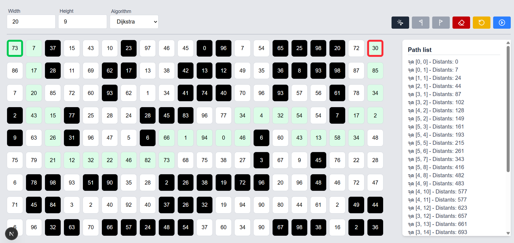

# Shortest Path Finder Simulator

A visual simulation tool for pathfinding algorithms built with Next.js, React, and TypeScript. This interactive application allows users to visualize how shortest path algorithms work on a customizable grid.

## 🚀 Features

- **Interactive Grid System**: Click to toggle obstacles and create custom maze layouts
- **Visual Path Finding**: Real-time visualization of the shortest path calculation
- **Dijkstra's Algorithm**: Implementation of the classic shortest path algorithm
- **Customizable Grid**: Adjustable grid dimensions (width and height)
- **Multiple Modes**: Toggle between obstacle placement, start point, and end point selection
- **Distance Visualization**: Each cell displays its distance value for the algorithm
- **Path Highlighting**: Visual indication of the calculated shortest path
- **Responsive Design**: Clean, modern UI built with Tailwind CSS

## 🎮 How to Use

### Basic Controls

1. **Set Grid Size**: Adjust the width and height input fields to change grid dimensions
2. **Select Mode**:
   - 🖱️ **Toggle Mode**: Click cells to add/remove obstacles (black cells are blocked)
   - 🏁 **Start Mode**: Click a cell to set the starting point (green border)
   - 🎯 **End Mode**: Click a cell to set the destination point (red border)

### Action Buttons

- **🖱️ Toggle**: Switch to obstacle placement mode
- **🏁 Start**: Switch to start point selection mode  
- **🎯 End**: Switch to end point selection mode
- **🗑️ Clear**: Reset start and end points
- **🔄 Regenerate**: Create a new random grid with different distance values
- **▶️ Find Path**: Calculate and display the shortest path

### Algorithm Selection

Currently supports:
- **Dijkstra's Algorithm**: Guaranteed to find the shortest path
- **A* Algorithm**: (Implementation in progress)

## 🛠️ Installation

1. Clone the repository:
```bash
git clone <repository-url>
cd shortest-path-finder-sim
```

2. Install dependencies:
```bash
npm install
```

3. Run the development server:
```bash
npm run dev
```

4. Open [http://localhost:3000](http://localhost:3000) in your browser

## 📦 Tech Stack

- **Framework**: Next.js 15.3.3
- **Language**: TypeScript 5
- **UI Library**: React 19
- **Styling**: Tailwind CSS 4
- **Icons**: Lucide React
- **Build Tool**: Turbopack (for faster development)

## 🏗️ Project Structure

```
src/
├── app/
│   ├── components/
│   │   ├── Button.tsx          # Reusable button component
│   │   └── Divider.tsx         # UI divider component
│   ├── utils/
│   │   └── dijkstra.ts         # Dijkstra algorithm implementation
│   ├── globals.css             # Global styles
│   ├── layout.tsx              # App layout
│   └── page.tsx                # Main application page
└── public/
    └── demo/
        └── demo.png            # Demo screenshot
```

## 🧮 Algorithm Details

### Dijkstra's Algorithm

The implementation uses Dijkstra's algorithm to find the shortest path between two points on a weighted grid:

1. **Initialization**: Set all distances to infinity except the starting node (distance = 0)
2. **Priority Queue**: Use a queue to process nodes in order of shortest distance
3. **Neighbor Exploration**: Check all adjacent cells (up, down, left, right)
4. **Distance Calculation**: Update distances based on cell weights plus current distance
5. **Path Reconstruction**: Backtrack from destination to source using previous node information

### Grid System

- Each cell has a `status` (1 = passable, 0 = blocked) and a `distant` value (weight)
- Distance values are randomly generated between 0-99 for simulation purposes
- The algorithm considers both the path length and cell weights when calculating optimal routes

## 🎯 Demo



## 📝 Available Scripts

- `npm run dev` - Start development server with Turbopack
- `npm run build` - Build for production
- `npm run start` - Start production server
- `npm run lint` - Run ESLint

## 🤝 Contributing

1. Fork the repository
2. Create a feature branch (`git checkout -b feature/amazing-feature`)
3. Commit your changes (`git commit -m 'Add amazing feature'`)
4. Push to the branch (`git push origin feature/amazing-feature`)
5. Open a Pull Request

## 📄 License

This project is open source and available under the [MIT License](LICENSE).
